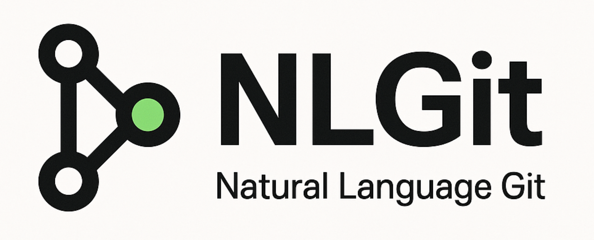

# NLGit - Natural Language Git



Control Git with natural language! NLGit is a cross-platform CLI tool that interprets your natural language instructions and executes Git operations locally using AI.

## Features

- 🗣️ **Natural Language Interface**: Just describe what you want to do
- 🔒 **Safe by Design**: Asks for confirmation on destructive operations
- 🚀 **Fast & Offline**: Runs locally with downloaded LLM models
- 🤖 **Agentic**: Makes intelligent decisions based on context
- 📝 **Operation History**: Track and potentially revert operations
- 🎨 **Beautiful CLI**: Interactive menus and clear feedback

## Installation

```bash
npm install -g natural-language-git
```

Or with yarn:

```bash
yarn global add natural-language-git
```

## Usage

Simply run `nlgit` followed by your natural language instruction in quotes:

```bash
nlgit "show me the status"
nlgit "create a new branch called feature-auth"
nlgit "commit all changes with message 'add login feature'"
nlgit "show me the last 5 commits"
nlgit "rebase with main and keep my changes"
```

### First Run

On first run, NLGit will guide you through:

1. Selecting an AI model (LLaMA or Mistral)
2. Downloading the model (only happens once)
3. Initializing the model

After onboarding, NLGit is ready to use!

## How It Works

1. **Parse**: NLGit uses a local LLM to understand your natural language request
2. **Analyze**: It determines what Git commands are needed and their safety level
3. **Confirm**: For destructive or cloud operations, it asks for your confirmation
4. **Execute**: It runs the Git commands and shows you the results
5. **Track**: All operations are logged for your reference

## Safety Levels

NLGit classifies operations into three safety levels:

- **Safe**: Auto-executed (status, log, diff, fetch, etc.)
- **Destructive**: Requires confirmation (reset, rebase, force operations)
- **Cloud**: Requires confirmation (push, pull, clone)

## Examples

### Check repository status
```bash
nlgit "what's the current status?"
```

### Create and switch to a branch
```bash
nlgit "create a branch named feature-x and switch to it"
```

### Commit changes
```bash
nlgit "stage all files and commit with message 'initial commit'"
```

### View history
```bash
nlgit "show me the last 10 commits"
```

### Merge branches
```bash
nlgit "merge develop into my current branch"
```

## Configuration

NLGit stores all data in `~/.nlgit/`:

- `config.json`: Selected model and preferences
- `models/`: Downloaded LLM models
- `history.json`: Operation history (last 50 operations)
- `logs/`: Temporary logs (auto-deleted after 24h)

## Supported Models

NLGit comes with two pre-configured models:

- **Meta-LLaMA-3-8B Instruct (Q5_K_M)**: Higher quality, larger size
- **Mistral 7B Instruct v0.2 (Q2_K)**: Faster, smaller size

You can switch models by running the onboarding again.

## Git Operations Supported

- Repository inspection (status, log, diff, show)
- Branch management (create, delete, switch, list)
- Commits (create, amend, revert)
- Staging (add, reset)
- Merging and rebasing
- Remote operations (push, pull, fetch)
- Stash operations
- Tag management
- And more!

## Non-Git Requests

NLGit is focused exclusively on Git operations. If you ask about non-Git topics, it will politely redirect you back to Git-related tasks.

## Requirements

- Node.js >= 20.0.0
- Git installed and configured
- macOS, Linux, or Windows

## Development

### Project Structure

```
src/
  ├── config/           # Configuration and cache management
  ├── models/           # Model download and management
  ├── llm/              # LLM integration (node-llama-cpp)
  ├── git-operations/   # Git command execution
  ├── ui/               # Terminal UI components
  ├── agent/            # Natural language interpretation
  ├── onboarding/       # Initial setup flow
  ├── history/          # Operation tracking
  └── index.ts          # CLI entry point
```

### Build

```bash
yarn install
yarn build
```

### Test

```bash
yarn test
```

### Lint

```bash
yarn lint
yarn format
```

## Contributing

Contributions are welcome! Please follow the EU Component Library Git Conventions for commit messages (see INSTRUCTIONS.md).

## License

MIT

## Acknowledgments

- Built with [node-llama-cpp](https://github.com/withcatai/node-llama-cpp)
- UI powered by [@inquirer/prompts](https://github.com/SBoudrias/Inquirer.js), [chalk](https://github.com/chalk/chalk), and [ora](https://github.com/sindresorhus/ora)
- Models from Hugging Face (Meta LLaMA and Mistral)

---

**Note**: NLGit is an AI-powered tool. While it strives for accuracy, always review suggested commands before confirming destructive operations.
